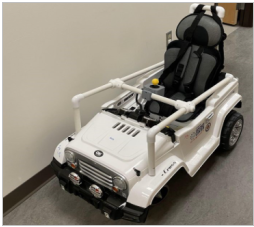

# GoBabyGo Joystick-Controlled Car
**(Input Class ID Here):First Year Engineering Projects - Colorado Mesa University**  
**Sponsor:** Talles Santos  
**Students:** Michael Riley (Mechanical Engineering)  
&emsp;&emsp;&emsp;&emsp;&emsp;Francisco Cuen (Mechanical Engineering)  
&emsp;&emsp;&emsp;&emsp;&emsp;Jaclyn Pellegrini (Mechanical Engineering)  
&emsp;&emsp;&emsp;&emsp;&emsp;Caleb Kasayka (Civil Engineering)  

## Introduction ##
“GoBabyGo” is a non-profit organization dedicated to providing children with limited mobility the opportunity to play independently by adapting motorized toy cars. Many children with mobility challenges struggle to press the pedal and steer simultaneously, making it difficult to operate the vehicle without constant assistance. Typical “GoBabyGo” modifications reroute the pedal wiring to a button mounted on the steering wheel, simplifying acceleration and improving usability.  

After multiple iterations, the final design operated successfully and remained within budget. It reliably controlled forward/backward motion and steering, and testing showed consistent performance with minimal drift. The system was safe, intuitive, and easy for children to use. Future work should focus on simplifying the steering circuit and adapting the design for broader use across different ride‑on car models to benefit more children.  

  
*The completed modified car*  

## Project Overview
While the standard modifications help many children, some still find it difficult to press a button and steer at the same time. This project aims to create a more intuitive control system by replacing both the pedal and steering wheel with a single joystick. The joystick must control forward and backward motion as well as left and right steering, operate safely under 12 V and 3 A, and be implemented for under $200.

### Physical/Body Changes
Put what physical changes you made to the body here
### Electrical Solutions
For this car, a modification was made for the movement. Using a joystick instead of a steering wheel and foot-powered pedals, the car can move forwards and backwards without restrictions, but turning left and right is altered. Instead of turning left and right without restriction, moving or holding the joystick in either direction causes the car to turn for only a set amount of time before stopping and waiting for another input. This is to help keep the motors from stalling as ... ? (Include a video/gif of the car moving in all four directions with the joystick)  
To implement the timed movement for turning left and right, a 555 circuit was created and added to each of the direction inputs.  

  
*555 Timer Circuit Diagram*  
&emsp;  
The combination of resistors and capacitors makes the five volt pulse from the timer last for only sec second before cutting off regardless of whether the joystick is still held down, resulting in the short burst of turning that the car experiences.  

  
*The Full Circuit Diagram of the car*  
&emsp;  

  
*The Full PCB Model of the car*  
&emsp;  

The full construction of the circuit requires the following components:
* [3 full BTS7960 High Current H-Bridge Motor Drivers](/Datasheets/BTS7960%20Motor%20Driver.pdf)
* [2 LM555 Timer Chips](/Datasheets/lm555.pdf)
* [A Joystick](/Datasheets/SANWA%20JLF-TP-8YT%20Joystick%20Instruction%20Manual.pdf)
* [An RC Car](/Datasheets/BCP%20Sky908%20User%20Manual.pdf)
* [2 NPN Bipolar Junction Transistors](/Datasheets/2n2222a.pdf)
* A 12V to 5V Voltage Step Down
* 6 100k Ohm Resistors
* 4 10k Ohm Resistors
* 4 10uF Capacitors
* A 12V Battery
