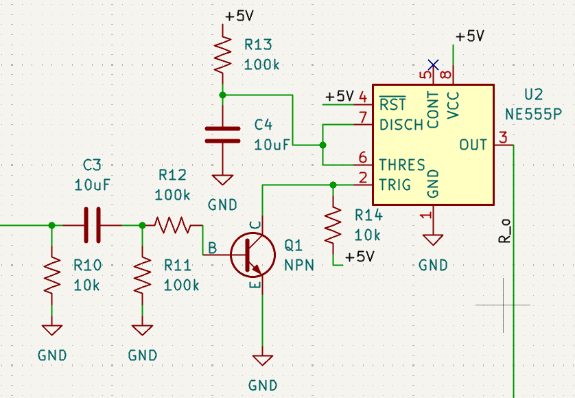
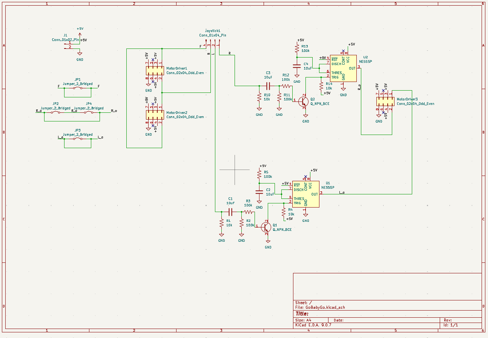
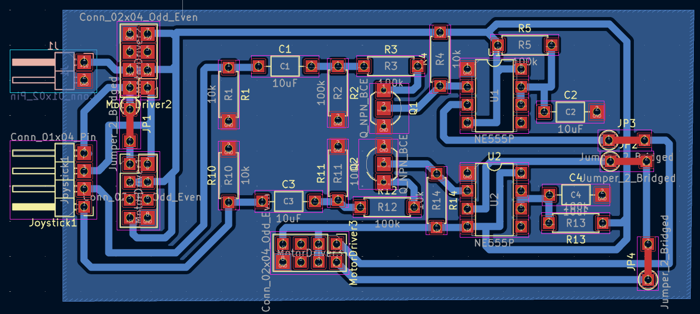

# GoBabyGo_joystick
**(Input Class ID Here):First Year Engineering Projects - Colorado Mesa University**  
**Sponsor:** Talles Santos  
**Students:** Michael Riley ()  
&emsp;&emsp;&emsp;&emsp;&emsp;Francisco Bainori (Mechanical Engineering)  
&emsp;&emsp;&emsp;&emsp;&emsp;Jaclyn Pellegrini (Mechanical Engineering)  
&emsp;&emsp;&emsp;&emsp;&emsp;Caleb Kasayka ()  

## Introduction ##
This is where the project introduction would go:
* Start it off with the project statement/purpose (Why you are doing the project, what does it solve, who is it for, etc.)
* Say how you solved it
* What came with solving it
* What you learned from solving the problem
* Show a picture of the complete car (and maybe have the kid driving it too)

## Project Overview
Brief overview/explanation of the entirity of the car and all of its notiable/altered features.  
Include:
* Anything budget or price related
### Physical/Body Changes
Put what physical changes you made to the body here
### Electrical Solutions
For this car, a modification was made for the movement. Using a joystick instead of a steering wheel and foot-powered pedals, the car can move forwards and backwards without restrictions, but turning left and right is altered. Instead of turning left and right without restriction, moving or holding the joystick in either direction causes the car to turn for only a set amount of time before stopping and waiting for another input. This is to help keep the motors from stalling as ... ? (Include a video/gif of the car moving in all four directions with the joystick)  
To implement the timed movement for turning left and right, a 555 circuit was created and added to each of the direction inputs.  

  
*555 Timer Circuit Diagram*  
&emsp;  
The combination of resistors and capacitors makes the five volt pulse from the timer last for only sec second before cutting off regardless of whether the joystick is still held down, resulting in the short burst of turning that the car experiences.  

  
*The Full Circuit Diagram of the car*  
&emsp;  

  
*The Full PCB Model of the car*  
&emsp;  

The full construction of the circuit requires the following components:
* [3 full BTS7960 High Current H-Bridge Motor Drivers](/Datasheets/BTS7960%20Motor%20Driver.pdf)
* [2 LM555 Timer Chips](/Datasheets/lm555.pdf)
* [A Joystick](PutLinkHere.webp)
* [4 Toy Car Motors](PutLinkHere.webp)
* [A 12V to 5V Voltage Step Down](PutLinkHere.webp)
* 2 NPN Bipolar Junction Transistors
* 6 100k Ohm Resistors
* 4 10k Ohm Resistors
* 4 10uF Capacitors
* A 12V Battery
