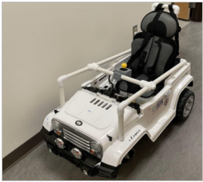
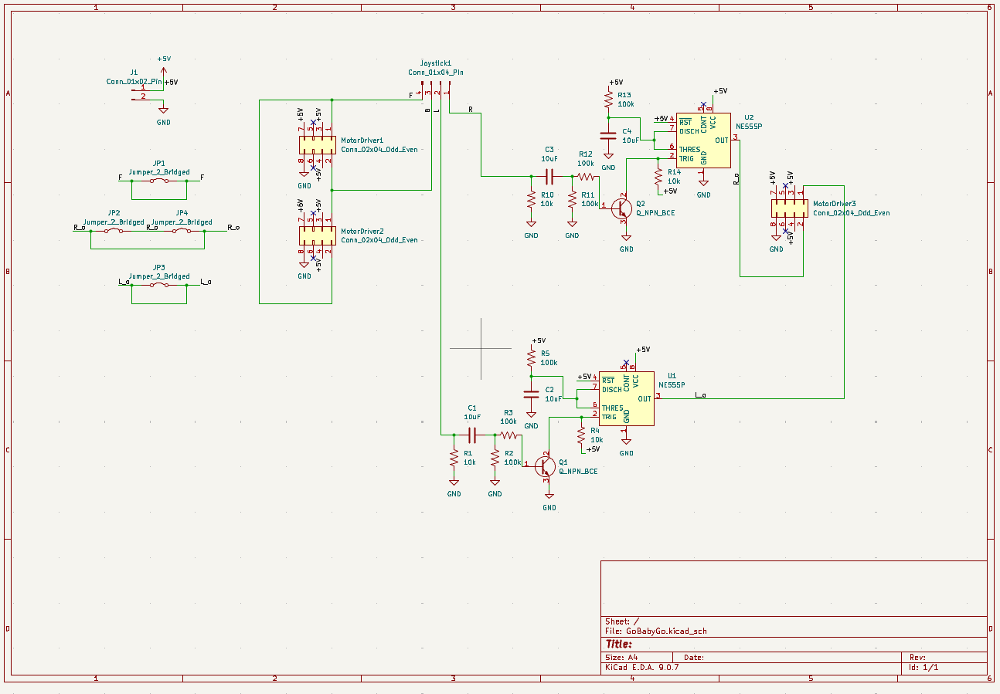
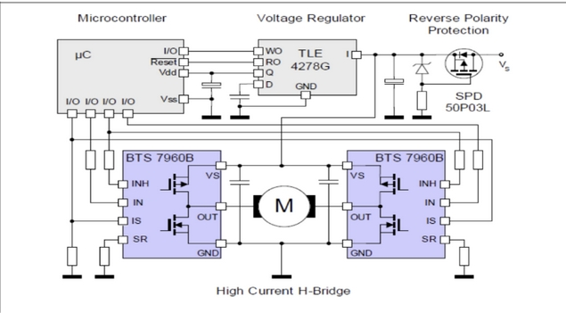
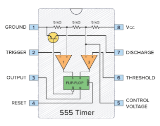
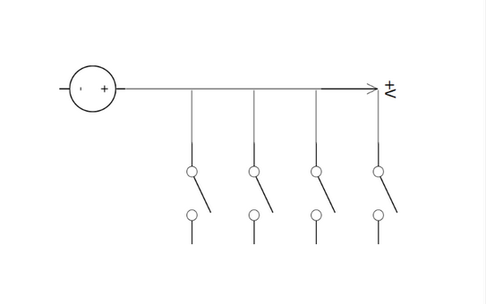
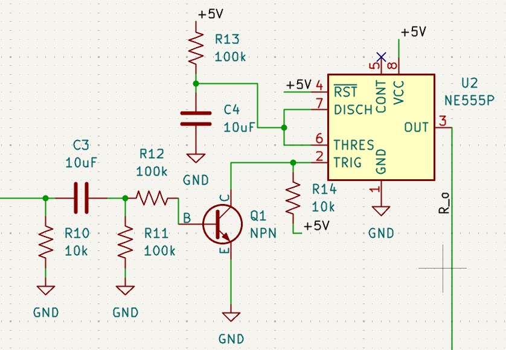
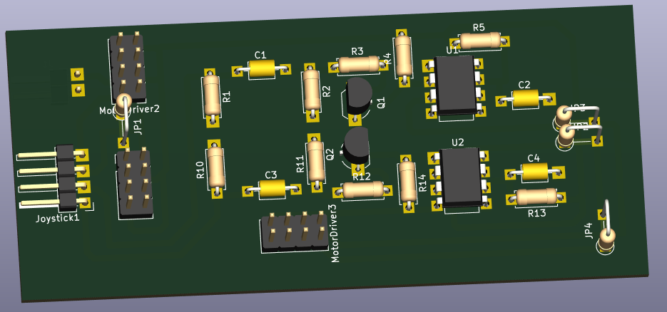
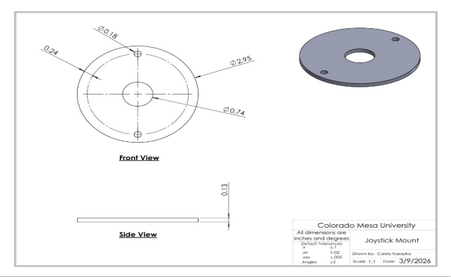
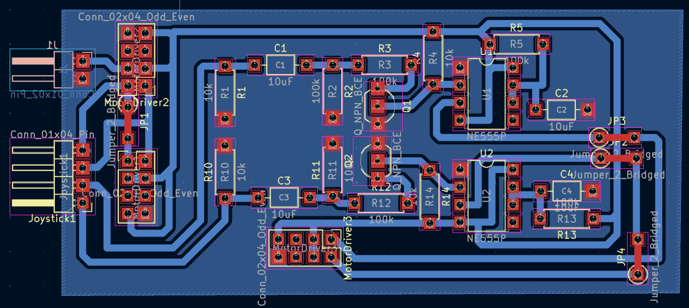

# GoBabyGo Joystick-Controlled Car
**ENGR140: First Year Engineering Projects - Colorado Mesa University**  
**Sponsor:** Talles Santos  
**Project Team:** Team Snow Munchers  
**Team Members:** Michael Riley (Civil Engineering)  
&emsp;&emsp;&emsp;&emsp;&emsp;&emsp;&emsp;&emsp; Francisco Cuen (Mechanical Engineering)  
&emsp;&emsp;&emsp;&emsp;&emsp;&emsp;&emsp;&emsp; Jaclyn Pellegrini (Mechanical Engineering)  
&emsp;&emsp;&emsp;&emsp;&emsp;&emsp;&emsp;&emsp;Caleb Kasayka (Mechanical Engineering)  
&emsp;  
&emsp;
&emsp;  
**Note: A large part of this README file references the [User Manual](/Reports/Users%20manual.pdf) and [Final Report](/Reports/Final%20Report%20First%20Draft%20-%20Snow%20Munchers.pdf) written by the members of the Snow Munchers Team. The printed circuit board (PCB) was designed, and the README was written and compiled, by Electrical and Computer Engineering Senior [Alyssa Jackson](https://github.com/aJax-EXE).**

## Introduction
“GoBabyGo” is a non-profit organization dedicated to providing children with limited mobility the opportunity to play independently by adapting motorized toy cars. Many children with mobility challenges struggle to press the pedal and steer simultaneously, making it difficult to operate the vehicle without constant assistance. Typical “GoBabyGo” modifications reroute the pedal wiring to a button mounted on the steering wheel, simplifying acceleration and improving usability.  

After multiple iterations, the final design operated successfully and remained within budget. It reliably controlled forward/backward motion and steering, and testing showed consistent performance with minimal drift. The system was safe, intuitive, and easy for children to use. Future work should focus on simplifying the steering circuit and adapting the design for broader use across different ride‑on car models to benefit more children.  

  
*A standin image of the completed modified car*  

## Project Overview
While the standard modifications help many children, some still find it difficult to press a button and steer at the same time. This project aims to create a more intuitive control system by replacing both the pedal and steering wheel with a single joystick. The joystick must control forward and backward motion as well as left and right steering, operate safely under 12 V and 3 A, and be implemented for under $200.  

### Design Requirements
Along with the functions that the car needs to reach from the the project overview, the following and specific requirements were needed:  
* Directional Control
    * Provide forward, reverse, left, and right motion; each direction successfully actuates correct motor behavior 10/10 trials with a response rate of .5 seconds. 
* Consistent Steering & Speed Response
    * Vehicle follows the same path in 5 repeated trials within acceptable tolerance (e.g., ±6 inches lateral drift over 10-15ft).
* 12V Maximum Power
    * Must not exceed 12V thought out the electrical system.
* Dashboard Fit
    * Total joystick assembly dimensions must not exceed 2.75 in (height) × 3.125 in (width). Zero interference points and no natural obstructions.
* Heat Limit
    * Must not exceed 113° over 15 minute time intervals.

###  Electrical Solutions
For this car, a modification was made for the movement. Using a joystick instead of a steering wheel and foot-powered pedals, the car can move forwards and backwards without restrictions, but turning left and right is altered. Instead of turning left and right without restriction, moving or holding the joystick in either direction causes the car to turn for only a set amount of time before stopping and waiting for another input. __This is to help keep the motors from stalling as ... ? (Include a video/gif of the car moving in all four directions with the joystick)__  

  
*The Full Circuit Diagram of the car*  
&emsp;  

The full construction of the circuit requires the following components:
* [3 IBT-2 BTS7960 High Current H-Bridge Motor Drivers](/Datasheets/BTS7960%20Motor%20Driver.pdf)  
&emsp;  
      
    *The Function diagram of an H-Bridge Controller*  
    &emsp;  

    * Full representation of the function of an H-Bridge Controller can be found in the above image. When an input is received, it sends a signal to the H-bridge motor controller which recognizes the voltage as a directional input and then outputs that signal into the motor itself. This allows for safe, effective, bi-directional movement. The H-bridge has a total of 12 attachment points. two for power in, two for power to motor, two for input detection (seen as “IN”), two for inhibiting direction (“INH”, two for ISs), a ground for the logic board (GND), and a 5.5V input for the logic board (“VCC”). This design will take advantage of all the inputs / outputs except for the SIs.
* [2 LM555 Timer Chips](/Datasheets/lm555.pdf)  
&emsp;  
      
    *Diagram of a 555 timer and the respective pins*  
    &emsp;  

    * A 555 timer is an integrated circuit that takes an electrical input and outputs a pulse over a certain interval of time. This component is needed to turn the front steering motor to a certain point so that the motor doesn’t overturn the mechanical component, breaking the car, and burning out the motor. Power is inputted through the VCC pin which powers the circuit (as seen in the above image). When a signal comes through the Trigger pin, it goes through the circuit within the 555 and then a capacitor and resistor attached to the discharge and threshold pins which controls how long a pulse is sent out of the output pin. For this project, the 555 is operated in monostable mode, meaning it sends out a singular pulse and then returns to its original state. To get the pulse to last for a certain time, the equation T=1.1RC where T is time, R is the strength of the resistor, and C is the value of the capacitor. For the motor a 1 second pulse is needed so values of a100kΩ resistor and a 10µF capacitor are needed.
* [A Joystick](/Datasheets/SANWA%20JLF-TP-8YT%20Joystick%20Instruction%20Manual.pdf)  
&emsp;  
      
    *Internal switching logic of the arcade joystick*  
    &emsp;  

    * The above image illustrates the internal switching logic of the joystick. The joystick has five wires with a gauge of 23 AWG (American Wire Gauge). These wires are connected to a circuit board via a connector. This system consists of four signal wires, each for a different switch that is also connected to the circuit board. The last wire serves as a 5V-12V source wire; the input (5V-12V) will flow through this wire and in return, will output through one of the four switches (possibly two) depending on which switch is compressed or activated. 
* [An RC Car](/Datasheets/BCP%20Sky908%20User%20Manual.pdf)
    * For this project an existing car was bought and provided to the group, but the car model used costs around $250 USD.

* [2 NPN Bipolar Junction Transistors](/Datasheets/2n2222a.pdf)  
&emsp;  
      
    *The circuit diagram of the pulse shaping module used in the car*  
&emsp;  
      
    *The 3D Model that represents what the working model looks like*  
&emsp;  

    * The transistors are the necessary part of the timing circuit. For the 555 to properly work, it needs sharp, high input. This is not as simple as it would seem because our joystick is mainly used in a “toggle” sense, where the driver will hold it left to turn left. After some testing, we realized that this toggled system would lead to the output of the 555 system always being held high. To fix this, we implemented what is called a pulse shaping module. This consists mainly of a capacitor momentarily allowing a transistor to drain a power source to ground, creating a quick pulse of electricity that the 555 timers can properly understand. The above images shows the pulse shaping module implemented into the design of the circuit and the 3D model of the completed PCB with all of its components.  
* [Joystick Mount](/3dModels/Joystick%20Mount%203.STL)
&emsp;  
      
    *The SolidWorks drawing of the joystick mount*  
    &emsp;  

    * The joystick already has two existing mounting holes, 0.278 inches in diameter, implemented into the factory design. With this, a CAD drawing was produced and integrated with these existing holes (see Appendix E). The design functions similar to a washer where it will mount on the original steering wheel location. Two bolts will run through the top (the side where the joystick extrudes), and below there will be two nuts securing the simple assembly in place. The above image consists of a SolidWorks drawing of the mount.  
* A 12V to 5V Voltage Step Down
    * Must be able to handle 3A of current and 15W of power.
* 6 100k Ohm Resistors
* 4 10k Ohm Resistors
* 4 10uF Capacitors
* A 12V Battery
    * The model of car used includes a 12V 7AH battery. Most electric kid cars run on 6V, but this system is designed for 12V. To use this system with a 6V battery, a voltage step down that goes from 6V to 5V, or rather a simple voltage divider, needs to be used to run the system properly.
* 2 Rolls of 20 AWG Wire
    * One red and one black preferred.  
* Female to Female Jumper wires  

The circuit starts at the battery going into the two gearboxed motors of the car and the voltage step down. The 5V from the stepdown powers the rest of the system: all three of the motor drivers and the two 555 timer circuits. While the forward and backwards motor drivers are only activated with the direct signal from the joystick, the left and right one first goes through there respective timing circuit to give the proper timed signal.  

  
*The Full PCB model for the car*  
&emsp;  

The PCB holds the resistors, capacitors, and transistors that make up the timing circuit, as well as all of the connectors necessary for both powering the board, connecting the joystick to the motor drivers, and for the motor drivers themselves.

## Hardware Setup and How to Operate
For the complete instructions on how to modify the car to replicate the project, perform maintainence, and for a full list of tools needed and how to use, refer to the [User Manual](/Reports/User%20Manual%20Outline.pdf) written by the Snow Munchers.

### Recommendations for Operation
Before general use, it is recommended that:  
* The driver does not exceed 77lbs
* The car avoids liquid 
* The car is not driven in the rain	 
* The car avoids sharp drops offs like curbs

## Results
### Overview
The electric ride on car was evaluated against the specified design requirements through structed user testing and system performance checks. Each criterion, directional control, steering consistency, power limit, heat limit, and size requirement, was assessed during real world operation to ensure the design met both functional and safety expectations. Users operated the vehicle under normal conditions, allowing the team to observe control, responsiveness, and overall usability. The system was required to satisfy all evaluation criteria in order to be considered successful. Testing results showed that the ride on car met all the design requirements, demonstrating reliable performance, safe operations, and suitability for its intended use.  
&emsp;  
### CRITERIA 1 – DIRECTIONAL CONTROL
Provide forward, reverse, left, and right motion; each direction successfully actuates correct motor behavior 10/10 trials with a response rate of .5 seconds.  

* **PURPOSE OF EVALUATION**: The purpose of the directional control test is to ensure that the electric ride on car responds accurately and reliably to user inputs. Effective directional control is essential for safe operations, as it allows the user to intentionally move the vehicle forward, backward, and laterally, ensuring the car can be maneuvered smoothly during normal operation and while navigating obstacles or turns. 

* **TESTING METHODS**: The evaluation of this design criteria requires that the user manually push the joystick in each direction, forward, backward, left, and right. This was tested in two ways, a static test, elevating the car off a flat surface so that the wheels can spin freely allowing the testers to visually see the steering response. And a dynamic test, driving the car through a specially crafted course designed with turns and corners to test the steering compacity while in motion. For the setup, the car was supported above a flat surface using four wooden 2 by 4 blocks, ensuring that all the wheels were fully suspended and unrestricted in rotation. This configuration eliminated ground friction and external load effects. Allowing isolated evaluation of the motor and steering response. With the vehicle secured, the joystick was actuated individually in the forward, reverse, left, and right directions. Observations were made to confirm correct wheel rotation direction, steering actuation, and immediate system response corresponding to each input. Any unintended motion, delay, or incorrect direction would indicate a fault in the signal interpretation or motor control. For the dynamic control test the electric ride on car was operated on a flat indoor surface and driven through a predefined course designed to replicate realistic operating conditions. The course consisted of straight sections, gradual turns, and sharp corners. Requiring continuous directional input adjustments. The user controlled the vehicle solely via the joystick, executing directional changes while the car remained in motion. This test evaluated the system’s ability to interpret joystick input under load, maintain control during directional transitions, and execute smooth turning without loss of stability or responsiveness. 

* **RESULTS & DISCUSSION**: The electric ride on car demonstrated correct directional response during both static and dynamic testing. In the static response test, joystick inputs in all four directions resulted in correct wheel movement with no observed latency, incorrect rotation, or unintended behavior. During the dynamic testing, the vehicle successfully followed the predetermined course and executed directional changes while in motion. The system maintained full responsiveness and directional accuracy thought out all test runs. No failures or loss of control were observed. As a result, the directional control system achieved a 100% success rate across all tests. The results indicated that the directional control system functions as intended under both unloaded and operational conditions. The static test confirmed control signal interpretation and motor actuation, while the dynamic test verified reliable performance under load. Although quantitative data was not collected, consistent qualitative performance across multiple trials demonstrates that the system meets the directional control requirements. The ability to maintain accurate direction changes while motion indicates sufficient control logic, motor response, and system integration. Therefore, the direction control design requirement was fully satisfied.  

### CRITERIA 2 – STEERING CONSISTENCY
Vehicle follows the same path in 5 repeated trials within acceptable tolerance (e.g., ±6 inches lateral drift over 10-15ft).  

* **PURPOSE OF EVALUATION**: The purpose of the steering consistency requirement is to ensure that the vehicle responds predictably and repeatably and repeatably to identical steering inputs. Consistent steering behavior is essential for user confidence, safe operation, and accurate maneuvering. This requirement verifies that the steering system produces uniform turning behavior without variation or drift during repeated use. 

* **TESTING METHODS**: Steering consistency was assessed using a straight-line deviation test. The vehicle was commanded to drive forward with a fixed joystick input while lateral deviation from a defined centerline was measured. The test evaluates the vehicle’s ability to maintain a straight trajectory under constant input. This method demonstrates whether the steering system produces predictable and repeatable behavior, which directly impacts controllability and user confidence in the finished product. For the setup, the steering consistency test was conducted on a flat, level surface to minimize external influences. A straight reference line was established using a tape measure at a fixed distance placed longitudinally along the test path. The electric ride on was aligned so that its centerline coincided with the reference line at the starting position. The vehicle was positioned at a consistent starting distance for each trial to ensure repeatability. During testing, the car was allowed to travel forward along the reference line while lateral deviation from the centerline was visually monitored and measured relative to the ruler. All tests were performed under identical surface and environment conditions to ensure consistent results. 

* **RESULTS & DISCUSSION**: The straight-line steering consistency test produced lateral drift across multiple trials and test length ranging from approximately 10 – 15ft. measured drift values varied significantly between trials, indicating nonuniform steering behavior under constant joystick input. Server trials remained within the ±6 in acceptance tolerance, deviations were small and showed no progressive drift over the test distance. However few outliers appeared in the tests but they were ruled out for being user error and were taken note of but not deemed important to the over all trials. Within this acceptance range, deviations were small and showed no progressive drift over the test distance. The compliant data demonstrates repeatable straight line tracking performance under consistent input conditions. The in tolerance results indicate that the steering system is capable of maintaining an acceptably straight trajectory when commanded with fixed forward input. The limited magnitude of lateral deviation suggests that the mechanical steering alignment and control response are sufficient for stable, predictable operation in the finished design. These results support the conclusion that, within defined performance limits, the steering system meets the consistency requirement. Maintaining deviation with ±6 inches ensures adequate controllability and user confidence during straight line motion.  

### CRITERIA 3 – POWER LIMIT
Must not exceed 12V thought out the electrical system.  

* **PURPOSE OF EVALUATION**: The purpose of the power limit requirement is to ensure that the electric ride on car operates within safe electric and mechanical limits. Restricted power output prevents excessive speed, reduces stress on system components such as the motor, battery, and drivetrain, and minimizes potential safety risks to the user. This requirement ensures controlled performance while maintaining reliability and compliance with design constraints for the finished project. 

* **TESTING METHODS**: To test, the power limit requirement was evaluated by measuring electrical current and voltage at key point throughout the vehicles electrical system. A multimeter was used to monitor voltage and current in selected wiring segments supplying the motor and control electronics during operation. Testing verified that system voltage remained below 12 V and that operating current did not exceed the specified limit of a 3 amp under normal driving conditions. Measurements were taken while the vehicle was powered and active to ensure compliance under realistic load conditions. For the setup, power limit testing was conducted using a digital multimeter to measure voltage and current at multiple points within the vehicle’s electrical system. Measurement locations included the batter output, motor supply lines, and control circuit wiring to capture representative operating conditions. The car was powered on and operated under normal operating conditions while the multimeter probes were connected in series for current measurement and in parallel for voltage measurement. Tests were performed while the vehicle was stationary and during motion to account for load variation. All measurements were taken with the system fully assembled to reflect real operating conditions. 

* **RESULTS & DISCUSSION**: Power limit testing confirmed that the electrical system operated within the defined constraints during all the testing conditions. Measured system voltage remained below the maximum allowable limit of 12V, and operating current did not exceed 3 amps at any monitored location. All measurements points across the battery, motor supply, and control wiring remained within the specified limits under both stationary and dynamic operating conditions, as a results, the power limit requirements was successfully met for all tests. The results confirm that the electrical power system operates within the specified voltage and current limits under normal operating conditions. Maintaining voltage below 12 V and current at or below 3 amps ensures safe operation of the motor and control electronics while reducing the risk of overheating, electrical stress, and components failure. Compliance with the power limit requirement indicates that the selected electrical components and system configuration are appropriately matched to the vehicle’s performance needs. This controlled power outage contributes to overall system reliability and user safety, supporting the suitability of the design for its intended application.  

### CRITERIA 4 – HEAT LIMIT
Must not exceed 113° over 15 minute time intervals.  

* **PURPOSE OF EVALUATION**: The purpose of the heat limit requirement is to ensure that the electrical and mechanical components of the electric ride on car operate within safe temperature ranges during normal use. Limiting heat buildup prevents thermal damage, reduced the risk of components failure, ensures user safety. This requirements supports system reliability longevity and consistent performance throughout operation. 

* **TESTING METHODS**: The heat limit requirement was evaluated by monitoring temperature during sustained operation. An Arduino based temperature sensing system was connected to the motor to continuously monitor thermal performance. The motor was operated continuously for a duration of 15 minutes under normal operating conditions. Temperature readings were observed to determine whether the motor temperature remained below the maximum allowable limit of 113 °F throughout the test period. For the setup, the heat limit was conducted using an Arduino microcontroller interfaced with a temperature sensor mounted directly to the motor casing to measure operating temperature. The sensor was secured to ensure consistent thermal contact and accurate temperature readings throughout the test. The electric ride on car was placed in a stationary configuration to allow continuous motor operation without external interruptions. Power was supplied under normal operating voltage, and the motors were run continuously for a 15 minute duration. Temperature reading were monitored in real time through the Arduino system to verify that the motor temperature remained below the maximum allowable limit of 113 °F for the entire test period.

* **RESULTS & DISCUSSION**: The heat limit requirement was considered satisfied based on qualitative observation during vehicle operation. Although a full 15 minute controlled temperature test was not completed due to time constraints, the motor was operated during multiple system tests without exhibiting signs of excessive heat build up. Though these test, the motor maintained stable performance with no observable thermal degradation, shut down, or adverse response related to heat generation. Based on the motors behavior during externed use and the absence of overheating indicators, the system was determined to operate within acceptable thermal limits. Although a full duration heat test was not completed, the observed system behavior during extended operations indicted that the motor operates within acceptable thermal limits. The absence of thermal issues during sustained use suggests that the selected motor and power configuration are sufficient for the intended operating conditions. While additional quantitative temperature data would strengthen validation, the qualitative results support the conclusion that the heat generation does not pose a safety or reliability concern for the current design. Future testing with continuous temperature logging over longer duration recommended to further validate thermal performance and confirm compliance under all operating scenarios.  

### CRITERIA 5 – SIZE REQUIREMENT
Total joystick assembly dimensions must not exceed 2.75 in (height) × 3.125 in (width). Zero interference points and no natural obstructions.  

* **PURPOSE OF EVALUATION**: The joystick components were required to fit within a designated envelope of 2.75in x 3.125 in space to ensure proper integration with the vehicle. Maintaining this size constraints prevents interference with vehicle operation, preserved drivability, and reduced the likelihood of accidental contact or mechanical damage during regular use. A compact fit also supports ergonomic accessibility for the user while allowing the control system to be securely mounted and protected within the vehicle structure.  

* **TESTING METHODS**: Size evaluation was conducted through a physical fitment verification and user interaction testing. The control circuit board was designed and assembled to conform to the allocated  dashboard of  2.75 in x 3.125 in. prior to permeant installation, the joystick components were temporally secured in the location using tape to allow visual and dimensional comparison with he available space. Once loosely secured, the vehicle was operated in a simulated use scenario. Testers interacted with the ride on car as a child user would, ensuring that the joystick and associated components did not obstruct operation, restrict movement, or practical useability of the installed parts.

* **RESULTS & DISCUSSION**: During size evaluation, the joystick mount component required four design iterations due to improper fit within the allocated dashboard space. Each reprint addressed dimensional and alignment issues until the final mount achieved a secure and accurate fit. The circuit board and associated wiring were successfully integrated within the design rea and remained neatly secured throughout testing. No components were exposed or positioned in a way that could be easily accessed or damaged during normal use. Once fully installed, all components fit securely within the available space without requiring further adjustment. These results confirm that the size requirement was met in the final configuration. Safe security of critical control components ensures the physical compatibly with the vehicle and is suitable for real-world use. Proper fitment directly affects drivability, user interaction, and long-term durability. Particularly in a ride on device intended for child use. Components that excess the allocated space or are improperly positioned introduce risks of accidental contact, interference during operation, or mechanical damage over time. The testing approach verifies dimensional compliance, simulating realistic user interaction. Supporting safe operation and reinforcing the overall robustness of the design.  

### Conclusion 
The electric ride on car joystick integration designed by the Snow Munchers team wad successfully evaluated against the defined design requirement using a combination of user testing, qualitative observation, and targeted system checks. The vehicle demonstrated reliable directional control and acceptable steering consistency under controlled testing conditions. Supporting predictable and safe maneuverability. Electric testing confirmed operation within the specified power limits, ensuring system safety and component reliability. Thermal performance did not present observable issues during extended operation, indicating the heat generation remains within acceptable bounds for the intended use. Additionally, the control components were successfully integrated within the allocated size constraints, preventing interference with drivability and reducing the risk of damage during regular use. Indicating the final design meets the primary functional, safety, and usability criteria created for the projects solid foundation and future refinement.  
&emsp;  

## Next Steps
Firstly, the telecontrol should be reattached. This feature was initially implemented into the car for safety, but the snow munchers did not have time to fully integrate this. To re-implement this feature, a second PCB would have to be printed to allow for toggleable control between the IBT-2 motor drivers and the standard relay. This could be done most simplistically with 4 transistors for each motor. Two to allow for flow from the telecontrol relay and the other two to allow for flow from the joystick. The second reintegration should be rewiring the lights. The old lights are already attached and ready to run, however they need to be wired to a new power to turn on with the car. Similarly, the sound system can be easily repaired; however, the old speaker was damaged when removed, so a replacement would need to be purchased and reinstalled inside the dashboard.

